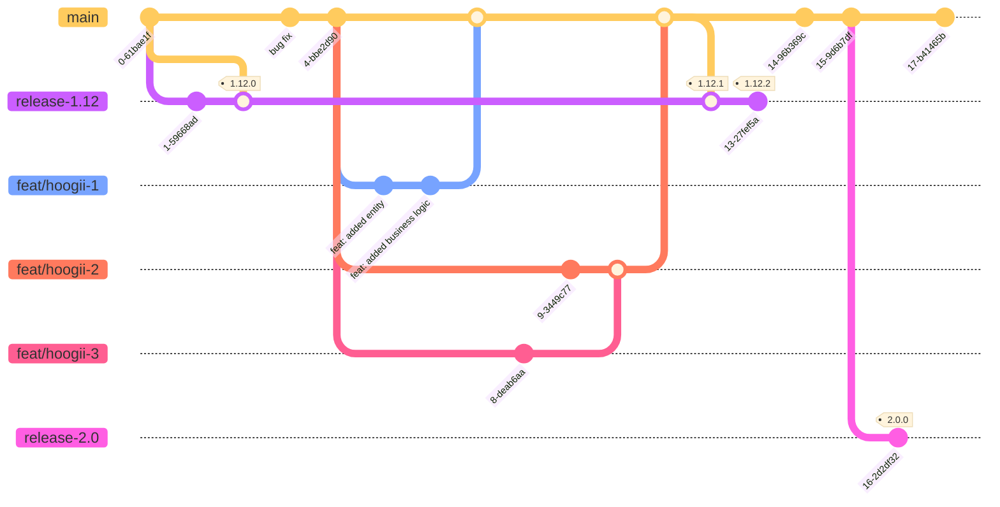

# Contributing

## Development Flow

We use [Trunk-based development](https://trunkbaseddevelopment.com/).

A source-control branching model, where developers collaborate on code in a single branch called 'trunk' \*, resist any
pressure to create other long-lived development branches by employing documented techniques. They therefore avoid merge
hell, do not break the build, and live happily ever after.

**Trunk-Based Development For Smaller Teams**


### Example



## Coding Style

### Names
- Use PascalCase for type names.
- Do not use I as a prefix for interface names.
- Use PascalCase for enum values.
- Use camelCase for function names.
- Use camelCase for property names and local variables.
- Do not use _ as a prefix for private properties.
- Use whole words in names when possible.

## Commit Signature

TODO

## Commit Message

### Commit Message Format

Each commit message consists of a **header**, a **body** and a **footer**. The header has a special
format that includes a **type**, a **scope** and a **subject**:

```
<type>(<scope>): <subject>
<BLANK LINE>
<body>
<BLANK LINE>
<footer>
```

The **header** is mandatory and the **scope** of the header is optional.

Example — `fix: remove unused dependency lodash.camelcase`

Any line of the commit message cannot be longer 100 characters. This allows the message to be easier to read on GitHub
as well as in various git tools.

#### Type

Must be one of the following:

* **feat**: A new feature.
* **fix**: A bug fix.
* **docs**: Documentation only changes.
* **style**: Changes that do not affect the meaning of the code (white-space, formatting, missing semi-colons, etc).
* **refactor**: A code change that neither fixes a bug nor adds a feature.
* **perf**: A code change that improves performance.
* **test**: Adding missing tests.
* **build**: Changes that affect the build system or external dependencies (example scopes: gulp, broccoli, npm)
* **ci**: Changes to our CI configuration files and scripts (example scopes: Travis, Circle, BrowserStack, SauceLabs)
* **chore**: Changes to the build process or auxiliary tools and libraries such as documentation generation.
* **revert**: Reverts a previous commit

#### Scope

The scope is optional and could be anything specifying place of the commit change. For example `nsis`, `mac`, `linux`,
etc...

#### Subject

The subject contains succinct description of the change:

* use the imperative, present tense: `change` not `changed` nor `changes`,
* don't capitalize first letter,
* no dot (.) at the end.

#### Body

Just as in the **subject**, use the imperative, present tense: "change" not "changed" nor "changes".
The body should include the motivation for the change and contrast this with previous behavior.

#### Footer

The footer should contain any information about **Breaking Changes** and is also the place to reference GitHub issues
that this commit **Closes**.
