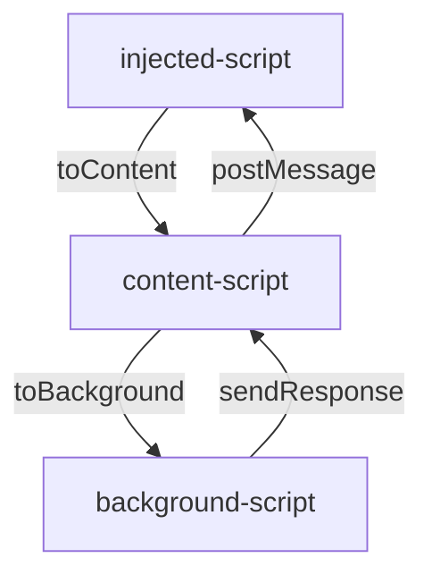
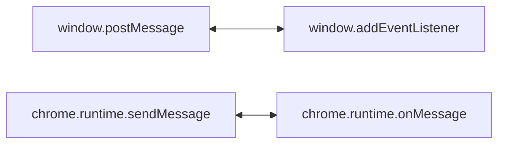

# Hoogii Wallet

[](https://github.com/hashgreen/hoogii-wallet/blob/main/LICENSE)

*"Hoogii"*

Some say it sounds like "fortune" in Hokkien (*hù-kuì*, 富貴); some others think it sounds similar to "partner" in Mandarin (*huo-ji*, 伙計).

Hoogii Wallet is simply a wallet committed to creating the most practical and easy-to-use crypto wallet on Chia Blockchain.
With Hoogii Wallet, you will be able to easily manage your assets on Chia Network.

<p align="center">
  
</p>

## Features

### Safely Manage Your Digital Asset

With Hoogii Wallet, you can send and receive Chia (XCH) / Chia Asset Tokens (CATs) or NFT (coming soon!) with customizable fees easily and safely on Chia Blockchain.

<p align="center">
  
</p>

### Check Your Activities at a Glance

Hoogii Wallet will make sure to record all of your digital assets on Chia Blockchain, and you can find all the transaction details in your Hoogii Wallet at any time.

<p align="center">
  
</p>

### Conveniently Manage Different Addresses

Set nicknames for addresses you frequently trade with to manage your digital assets on Chia Blockchain in the easiest way.

<p align="center">
  
</p>

### Display Won Blocks for Chia Farms

If you are a Chia farmer, then you come to the right place! Hoogii Wallet displays all your won blocks from your Chia farms so you never miss the chance to brag to your friends!

### Links Directly With Chia's First AMM & dApps

In future updates, users can transact with the first AMM and other dApps on Chia Blockchain directly within Hoogii Wallet.

### Deposit USDS via Credit Card or Other Payments

In future updates, you will be able to deposit USDS ([Stably USD](https://coinmarketcap.com/currencies/stableusd/)) within Hoogii Wallet using credit cards or other payment methods.

## Package Installation

Install Hoogii Wallet on [Chrome Web Store](https://chrome.google.com/webstore/detail/hoogii-wallet/jljjeghmeihjegifdhbghcoihdiegkkl).

## For Developers

### Prerequisites

For development, you will only need Node.js installed on your environment.
The recommended package manager is `yarn`, and please follow the instructions below to set up.

- Node

    [Node.js](http://nodejs.org/) is easy to install along with [NPM](https://npmjs.org/).
    You should be able to check the version after the installation procedure.

    ```bash
    $ node --version
    v16.15.1
    $ npm --version
    8.11.0
    $ yarn --version
    1.22.18
    ```

### Development

To build and run Hoogii Wallet from source, please follow the instructions.

- Configure environments

    Copy the .env.example file to .env.extension at project root

- Clone this repository

    ```sh
    git clone git@github.com:hashgreen/hoogii-wallet.git && cd hoogii-wallet
    yarn install
    ```

- Start development server

    ```sh
    yarn dev
    ```

- Create production build

    ```sh
    yarn build
    ```

- Upgrade package version & Add tag to publish new version

    ```sh
    yarn prerelease && git push && git push origin <tag_name>  
    ```

- Show help

    ```sh
    make help
    ```

- Patch version

    ```sh
    make patch
    # npm version patch --preid=dev

    git push && git push --tags
    ```

- Build the project to the ./dist/ folder with yarn build.

    ```sh
    yarn build
    ```

- Start development server

    ```sh
    yarn dev:extension
    ```

    install unpack `/dist` folder from chrome browser in developer mode

### Technical Details

Below are a few core concepts in the development of Hoogii Wallet.
Please be patient and we'll come back to drop in some more technical insights and discussions (wink)!





### Contributing

Pull requests are welcome. For major changes, please open an issue first to discuss what you would like to change and make sure to update tests as appropriate.

## Links

- [Landing Page](https://hoogii.app/)
- [Discord](https://discord.com/invite/eQkGXgprvn)
- [Twitter](https://twitter.com/Hoogii_app)
- [Medium](https://hoogii-app.medium.com/)

## License

[https://www.apache.org/licenses/LICENSE-2.0](https://www.apache.org/licenses/LICENSE-2.0)
