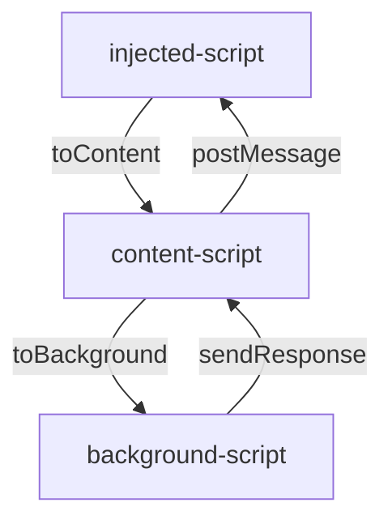
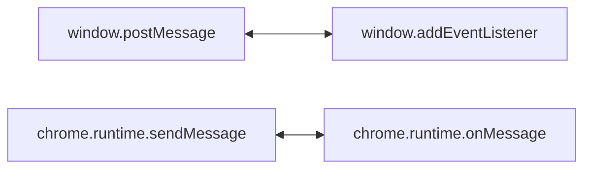

# Hoogii Wallet

## Introduce

Hoogii Wallet is committed to creating the most practical and easy-to-use crypto wallet on Chia Network. With Hoogii Wallet, you will be able to easily manage your assets on Chia Network.


<br>
<br>

## Installation

Install Hoogii Wallet on Google Chrome extension：[Install here](https://chrome.google.com/webstore/detail/hoogii-wallet/jljjeghmeihjegifdhbghcoihdiegkkl)
<br>
<br>

## Contributing

Pull requests are welcome. For major changes, please open an issue first to discuss what you would like to change.Please make sure to update tests as appropriate.
<br>
<br>

## Requirements

For development, you will only need Node.js installed on your environement.
Recommand to use `yarn` as package management (not mandatory).
The following guideline with use yarn.

- **Node**

    [Node](http://nodejs.org/) is really easy to install & now include [NPM](https://npmjs.org/).
    You should be able to run the following command after the installation procedure
    below.

    ```bash
    $ node --version
    v16.15.1

    $ npm --version
    8.11.0
    ❯ yarn --version
    1.22.18
    ```
<br>
<br>

## Develop

- **Install**

    ```bash
    git clone git@github.com:hashgreen/hoogii-wallet.git
    cd hoogii-wallet
    yarn install
    ```

- **Start development server**

    ```bash
    yarn dev
    ```

- **Create production build**

    ```bash
    yarn build
    ```

- **Upgrade package version & Add tag to publish new version**

    ```bash
    yarn prerelease && git push && git push --tags  
    ```

- **Show help**

```shell
make help
```

- **Patch version**

```shell
make patch
# npm version patch --preid=dev

git push && git push --tags
```





<br>
<br>

## Important Links

- [Landing Page](https://hoogii.app/)
- [Discord](https://discord.com/invite/eQkGXgprvn)
- [Twitter](https://twitter.com/Hoogii_app)
- [Medium](https://hoogii-app.medium.com/)

<br>
<br>

## License

[https://www.apache.org/licenses/LICENSE-2.0](https://www.apache.org/licenses/LICENSE-2.0)
